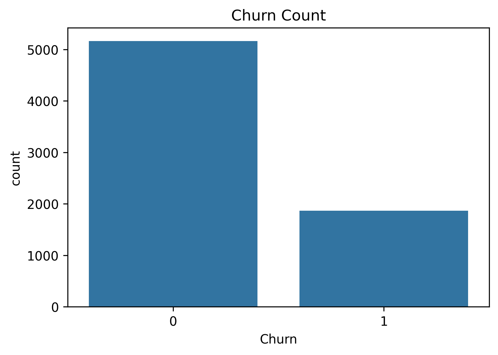
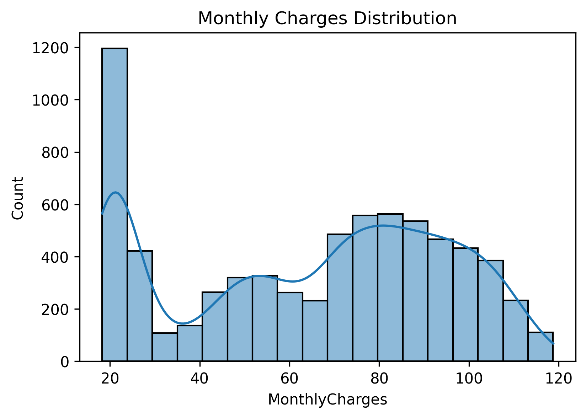
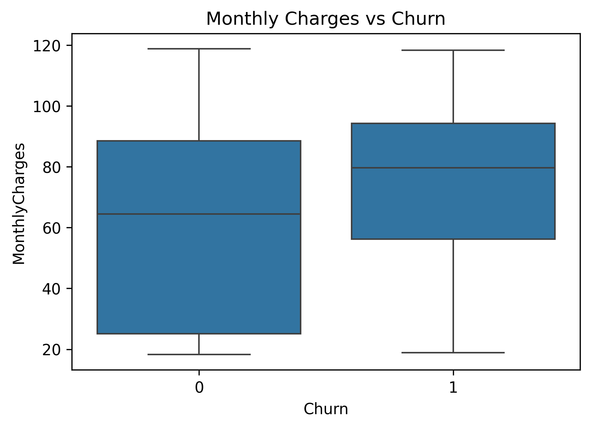
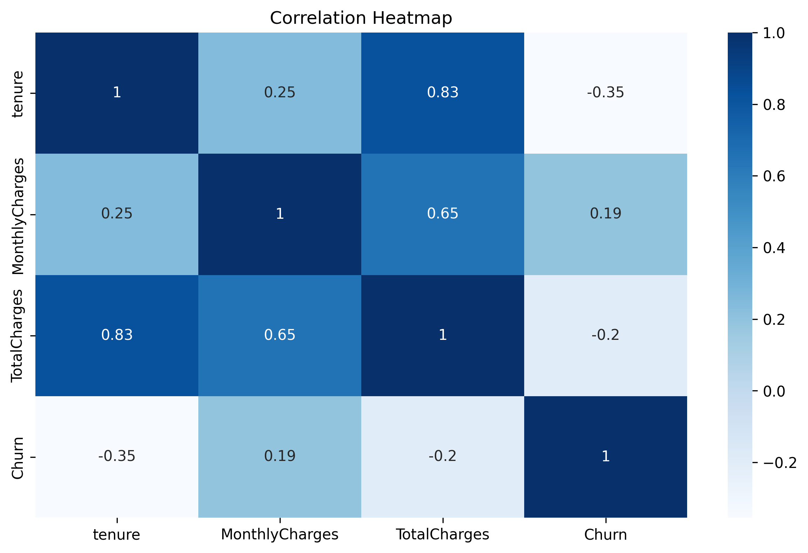

# Customer Churn Analysis

Author: Ayush Saini  
Tools: Python, Pandas, NumPy, Matplotlib, Seaborn

## Overview
This project analyzes the Telco Customer Churn dataset to understand why customers leave a telecom company. The goal is to identify churn patterns and provide recommendations that can help reduce customer attrition.

## Repository Structure
Customer-Churn-Analysis/
│── data/
│ └── Telco_Customer_Churn.csv
│── notebooks/
│ └── churn_analysis.ipynb
│── images/
│ ├── churn_count.png
│ ├── monthly_charges_dist.png
│ ├── monthly_charges_vs_churn.png
│ ├── tenure_vs_churn.png
│ └── correlation_heatmap.png
│── README.md

markdown
Copy code

## Data Cleaning
- Converted "TotalCharges" to numeric  
- Removed rows with missing TotalCharges  
- Dropped "customerID"  
- Converted "Churn" to binary (Yes = 1, No = 0)

## Visuals
### Churn Count

### Monthly Charges Distribution

### Monthly Charges vs Churn

### Tenure vs Churn

### Correlation Heatmap

## Insights
- Month-to-month contract customers churn the most.  
- Higher monthly charges correlate with higher churn.  
- New customers (0–6 months tenure) churn more frequently.  
- Electronic Check users show the highest churn rate.  
- Fiber Optic customers churn more than DSL customers.  
- Senior citizens churn more compared to younger customers.

## Recommendations
- Offer onboarding benefits to new customers.  
- Encourage yearly/long-term contracts.  
- Improve Fiber Optic service quality.  
- Promote Tech Support and Online Security services.  
- Enhance payment experience for Electronic Check users.
